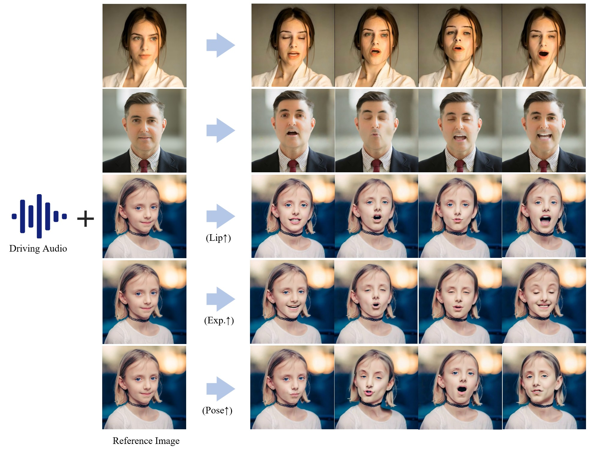
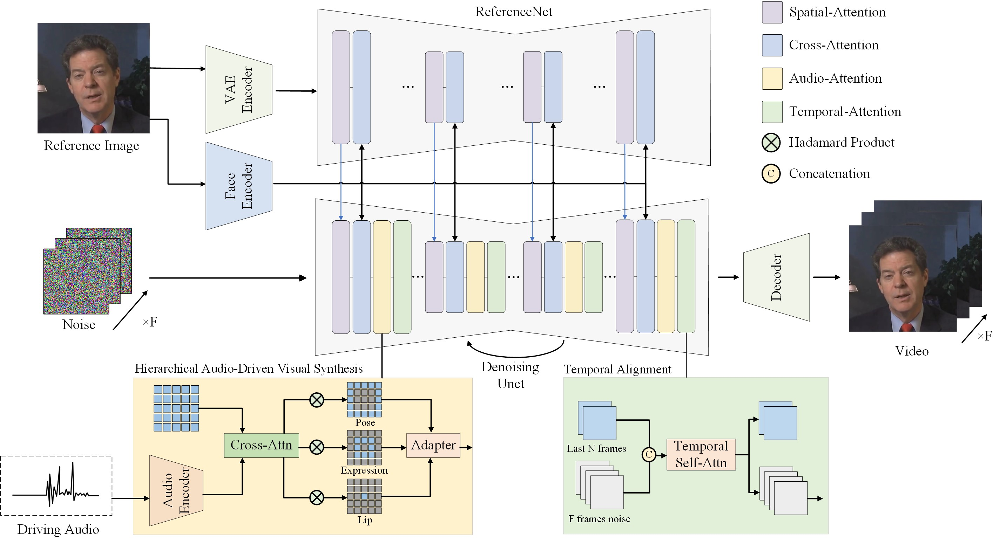

<h1 align='center'>Hallo: Hierarchical Audio-Driven Visual Synthesis for Portrait Image Animation</h1>

<div align='center'>
    <a href='https://github.com/xumingw' target='_blank'>Mingwang Xu</a><sup>1*</sup>&emsp;
    <a href='https://github.com/crystallee-ai' target='_blank'>Hui Li</a><sup>1*</sup>&emsp;
    <a href='https://github.com/subazinga' target='_blank'>Qingkun Su</a><sup>1*</sup>&emsp;
    <a href='https://github.com/NinoNeumann' target='_blank'>Hanlin Shang</a><sup>1</sup>&emsp;
    <a href='https://github.com/AricGamma' target='_blank'>Liwei Zhang</a><sup>1</sup>&emsp;
    <a href='https://github.com/cnexah' target='_blank'>Ce Liu</a><sup>3</sup>&emsp;
</div>
<div align='center'>
    <a href='https://jingdongwang2017.github.io/' target='_blank'>Jingdong Wang</a><sup>2</sup>&emsp;
    <a href='https://yoyo000.github.io/' target='_blank'>Yao Yao</a><sup>4</sup>&emsp;
    <a href='https://sites.google.com/site/zhusiyucs/home' target='_blank'>Siyu Zhu</a><sup>1</sup>&emsp;
</div>

<div align='center'>
    <sup>1</sup>Fudan University&emsp; <sup>2</sup>Baidu Inc&emsp; <sup>3</sup>ETH Zurich&emsp; <sup>4</sup>Nanjing University
</div>

<br>
<div align='center'>
    <a href='https://github.com/fudan-generative-vision/hallo'></a>
    <a href='https://fudan-generative-vision.github.io/hallo/#/'></a>
    <a href='https://arxiv.org/pdf/2406.08801'></a>
    <a href='https://huggingface.co/fudan-generative-ai/hallo'></a>
    <a href='https://huggingface.co/spaces/fffiloni/tts-hallo-talking-portrait'></a>
    <a href='https://www.modelscope.cn/models/fudan-generative-vision/Hallo/summary'></a>
    <a href='assets/wechat.jpeg'></a>
</div>

<br>

## 📸 Showcase


https://github.com/fudan-generative-vision/hallo/assets/17402682/9d1a0de4-3470-4d38-9e4f-412f517f834c

### 🎬 Honoring Classic Films

<table class="center">
  <tr>
    <td style="text-align: center"><b>Devil Wears Prada</b></td>
    <td style="text-align: center"><b>Green Book</b></td>
    <td style="text-align: center"><b>Infernal Affairs</b></td>
  </tr>
  <tr>
    <td style="text-align: center"><a target="_blank" href="https://cdn.aondata.work/video/short_movie/Devil_Wears_Prada-480p.mp4"></a></td>
    <td style="text-align: center"><a target="_blank" href="https://cdn.aondata.work/video/short_movie/Green_Book-480p.mp4"></a></td>
    <td style="text-align: center"><a target="_blank" href="https://cdn.aondata.work/video/short_movie/无间道-480p.mp4"></a></td>
  </tr>
  <tr>
    <td style="text-align: center"><b>Patch Adams</b></td>
    <td style="text-align: center"><b>Tough Love</b></td>
    <td style="text-align: center"><b>Shawshank Redemption</b></td>
  </tr>
  <tr>
    <td style="text-align: center"><a target="_blank" href="https://cdn.aondata.work/video/short_movie/Patch_Adams-480p.mp4"></a></td>
    <td style="text-align: center"><a target="_blank" href="https://cdn.aondata.work/video/short_movie/Tough_Love-480p.mp4"></a></td>
    <td style="text-align: center"><a target="_blank" href="https://cdn.aondata.work/video/short_movie/Shawshank-480p.mp4"></a></td>
  </tr>
</table>

Explore [more examples](https://fudan-generative-vision.github.io/hallo).

## 📰 News

- **`2024/06/28`**: 🎉🎉🎉 We are proud to announce the release of our model training code. Try your own training data. Here is [tutorial](#training).
- **`2024/06/21`**: 🚀🚀🚀 Cloned a Gradio demo on [🤗Huggingface space](https://huggingface.co/spaces/fudan-generative-ai/hallo).
- **`2024/06/20`**: 🌟🌟🌟 Received numerous contributions from the community, including a [Windows version](https://github.com/sdbds/hallo-for-windows), [ComfyUI](https://github.com/AIFSH/ComfyUI-Hallo), [WebUI](https://github.com/fudan-generative-vision/hallo/pull/51), and [Docker template](https://github.com/ashleykleynhans/hallo-docker).
- **`2024/06/15`**: ✨✨✨ Released some images and audios for inference testing on [🤗Huggingface](https://huggingface.co/datasets/fudan-generative-ai/hallo_inference_samples).
- **`2024/06/15`**: 🎉🎉🎉 Launched the first version on 🫡[GitHub](https://github.com/fudan-generative-vision/hallo).

## 🤝 Community Resources

Explore the resources developed by our community to enhance your experience with Hallo:

- [TTS x Hallo Talking Portrait Generator](https://huggingface.co/spaces/fffiloni/tts-hallo-talking-portrait) - Check out this awesome Gradio demo by [@Sylvain Filoni](https://huggingface.co/fffiloni)! With this tool, you can conveniently prepare portrait image and audio for Hallo.
- [Demo on Huggingface](https://huggingface.co/spaces/multimodalart/hallo) - Check out this easy-to-use Gradio demo by [@multimodalart](https://huggingface.co/multimodalart).
- [hallo-webui](https://github.com/daswer123/hallo-webui) - Explore the WebUI created by [@daswer123](https://github.com/daswer123).
- [hallo-for-windows](https://github.com/sdbds/hallo-for-windows) - Utilize Hallo on Windows with the guide by [@sdbds](https://github.com/sdbds).
- [ComfyUI-Hallo](https://github.com/AIFSH/ComfyUI-Hallo) - Integrate Hallo with the ComfyUI tool by [@AIFSH](https://github.com/AIFSH).
- [hallo-docker](https://github.com/ashleykleynhans/hallo-docker) - Docker image for Hallo by [@ashleykleynhans](https://github.com/ashleykleynhans).
- [RunPod Template](https://runpod.io/console/deploy?template=aeyibwyvzy&ref=2xxro4syy) - Deploy Hallo to RunPod by [@ashleykleynhans](https://github.com/ashleykleynhans).
- [JoyHallo](https://jdh-algo.github.io/JoyHallo/) - JoyHallo extends the capabilities of Hallo, enabling it to support Mandarin

Thanks to all of them.

Join our community and explore these amazing resources to make the most out of Hallo. Enjoy and elevate their creative projects!

## 🔧️ Framework




## ⚙️ Installation

- System requirement: Ubuntu 20.04/Ubuntu 22.04, Cuda 12.1
- Tested GPUs: A100

Create conda environment:

```bash
  conda create -n hallo python=3.10
  conda activate hallo
```

Install packages with `pip`

```bash
  pip install -r requirements.txt
  pip install .
```

Besides, ffmpeg is also needed:
```bash
  apt-get install ffmpeg
```

## 🗝️️ Usage

The entry point for inference is `scripts/inference.py`. Before testing your cases, two preparations need to be completed:

1. [Download all required pretrained models](#download-pretrained-models).
2. [Prepare source image and driving audio pairs](#prepare-inference-data).
3. [Run inference](#run-inference).

### 📥 Download Pretrained Models

You can easily get all pretrained models required by inference from our [HuggingFace repo](https://huggingface.co/fudan-generative-ai/hallo).

Clone the pretrained models into `${PROJECT_ROOT}/pretrained_models` directory by cmd below:

```shell
git lfs install
git clone https://huggingface.co/fudan-generative-ai/hallo pretrained_models
```

Or you can download them separately from their source repo:

- [hallo](https://huggingface.co/fudan-generative-ai/hallo/tree/main/hallo): Our checkpoints consist of denoising UNet, face locator, image & audio proj.
- [audio_separator](https://huggingface.co/huangjackson/Kim_Vocal_2): Kim\_Vocal\_2 MDX-Net vocal removal model. (_Thanks to [KimberleyJensen](https://github.com/KimberleyJensen)_)
- [insightface](https://github.com/deepinsight/insightface/tree/master/python-package#model-zoo): 2D and 3D Face Analysis placed into `pretrained_models/face_analysis/models/`. (_Thanks to deepinsight_)
- [face landmarker](https://storage.googleapis.com/mediapipe-models/face_landmarker/face_landmarker/float16/1/face_landmarker.task): Face detection & mesh model from [mediapipe](https://ai.google.dev/edge/mediapipe/solutions/vision/face_landmarker#models) placed into `pretrained_models/face_analysis/models`.
- [motion module](https://github.com/guoyww/AnimateDiff/blob/main/README.md#202309-animatediff-v2): motion module from [AnimateDiff](https://github.com/guoyww/AnimateDiff). (_Thanks to [guoyww](https://github.com/guoyww)_).
- [sd-vae-ft-mse](https://huggingface.co/stabilityai/sd-vae-ft-mse): Weights are intended to be used with the diffusers library. (_Thanks to [stablilityai](https://huggingface.co/stabilityai)_)
- [StableDiffusion V1.5](https://huggingface.co/runwayml/stable-diffusion-v1-5): Initialized and fine-tuned from Stable-Diffusion-v1-2. (_Thanks to [runwayml](https://huggingface.co/runwayml)_)
- [wav2vec](https://huggingface.co/facebook/wav2vec2-base-960h): wav audio to vector model from [Facebook](https://huggingface.co/facebook/wav2vec2-base-960h).

Finally, these pretrained models should be organized as follows:

```text
./pretrained_models/
|-- audio_separator/
|   |-- download_checks.json
|   |-- mdx_model_data.json
|   |-- vr_model_data.json
|   `-- Kim_Vocal_2.onnx
|-- face_analysis/
|   `-- models/
|       |-- face_landmarker_v2_with_blendshapes.task  # face landmarker model from mediapipe
|       |-- 1k3d68.onnx
|       |-- 2d106det.onnx
|       |-- genderage.onnx
|       |-- glintr100.onnx
|       `-- scrfd_10g_bnkps.onnx
|-- motion_module/
|   `-- mm_sd_v15_v2.ckpt
|-- sd-vae-ft-mse/
|   |-- config.json
|   `-- diffusion_pytorch_model.safetensors
|-- stable-diffusion-v1-5/
|   `-- unet/
|       |-- config.json
|       `-- diffusion_pytorch_model.safetensors
`-- wav2vec/
    `-- wav2vec2-base-960h/
        |-- config.json
        |-- feature_extractor_config.json
        |-- model.safetensors
        |-- preprocessor_config.json
        |-- special_tokens_map.json
        |-- tokenizer_config.json
        `-- vocab.json
```

### 🛠️ Prepare Inference Data

Hallo has a few simple requirements for input data:

For the source image:

1. It should be cropped into squares.
2. The face should be the main focus, making up 50%-70% of the image.
3. The face should be facing forward, with a rotation angle of less than 30° (no side profiles).

For the driving audio:

1. It must be in WAV format.
2. It must be in English since our training datasets are only in this language.
3. Ensure the vocals are clear; background music is acceptable.

We have provided [some samples](examples/) for your reference.

### 🎮 Run Inference

Simply to run the `scripts/inference.py` and pass `source_image` and `driving_audio` as input:

```bash
python scripts/inference.py --source_image examples/reference_images/1.jpg --driving_audio examples/driving_audios/1.wav
```

Animation results will be saved as `${PROJECT_ROOT}/.cache/output.mp4` by default. You can pass `--output` to specify the output file name. You can find more examples for inference at [examples folder](https://github.com/fudan-generative-vision/hallo/tree/main/examples).

For more options:

```shell
usage: inference.py [-h] [-c CONFIG] [--source_image SOURCE_IMAGE] [--driving_audio DRIVING_AUDIO] [--output OUTPUT] [--pose_weight POSE_WEIGHT]
                    [--face_weight FACE_WEIGHT] [--lip_weight LIP_WEIGHT] [--face_expand_ratio FACE_EXPAND_RATIO]

options:
  -h, --help            show this help message and exit
  -c CONFIG, --config CONFIG
  --source_image SOURCE_IMAGE
                        source image
  --driving_audio DRIVING_AUDIO
                        driving audio
  --output OUTPUT       output video file name
  --pose_weight POSE_WEIGHT
                        weight of pose
  --face_weight FACE_WEIGHT
                        weight of face
  --lip_weight LIP_WEIGHT
                        weight of lip
  --face_expand_ratio FACE_EXPAND_RATIO
                        face region
```

## Training

### Prepare Data for Training

The training data, which utilizes some talking-face videos similar to the source images used for inference, also needs to meet the following requirements:

1. It should be cropped into squares.
2. The face should be the main focus, making up 50%-70% of the image.
3. The face should be facing forward, with a rotation angle of less than 30° (no side profiles).

Organize your raw videos into the following directory structure:


```text
dataset_name/
|-- videos/
|   |-- 0001.mp4
|   |-- 0002.mp4
|   |-- 0003.mp4
|   `-- 0004.mp4
```

You can use any `dataset_name`, but ensure the `videos` directory is named as shown above.

Next, process the videos with the following commands:

```bash
python -m scripts.data_preprocess --input_dir dataset_name/videos --step 1
python -m scripts.data_preprocess --input_dir dataset_name/videos --step 2
```

**Note:** Execute steps 1 and 2 sequentially as they perform different tasks. Step 1 converts videos into frames, extracts audio from each video, and generates the necessary masks. Step 2 generates face embeddings using InsightFace and audio embeddings using Wav2Vec, and requires a GPU. For parallel processing, use the `-p` and `-r` arguments. The `-p` argument specifies the total number of instances to launch, dividing the data into `p` parts. The `-r` argument specifies which part the current process should handle. You need to manually launch multiple instances with different values for `-r`.

Generate the metadata JSON files with the following commands:

```bash
python scripts/extract_meta_info_stage1.py -r path/to/dataset -n dataset_name
python scripts/extract_meta_info_stage2.py -r path/to/dataset -n dataset_name
```

Replace `path/to/dataset` with the path to the parent directory of `videos`, such as `dataset_name` in the example above. This will generate `dataset_name_stage1.json` and `dataset_name_stage2.json` in the `./data` directory.

### Training

Update the data meta path settings in the configuration YAML files, `configs/train/stage1.yaml` and `configs/train/stage2.yaml`:


```yaml
#stage1.yaml
data:
  meta_paths:
    - ./data/dataset_name_stage1.json

#stage2.yaml
data:
  meta_paths:
    - ./data/dataset_name_stage2.json
```

Start training with the following command:

```shell
accelerate launch -m \
  --config_file accelerate_config.yaml \
  --machine_rank 0 \
  --main_process_ip 0.0.0.0 \
  --main_process_port 20055 \
  --num_machines 1 \
  --num_processes 8 \
  scripts.train_stage1 --config ./configs/train/stage1.yaml
```

#### Accelerate Usage Explanation

The `accelerate launch` command is used to start the training process with distributed settings.

```shell
accelerate launch [arguments] {training_script} --{training_script-argument-1} --{training_script-argument-2} ...
```

**Arguments for Accelerate:**

- `-m, --module`: Interpret the launch script as a Python module.
- `--config_file`: Configuration file for Hugging Face Accelerate.
- `--machine_rank`: Rank of the current machine in a multi-node setup.
- `--main_process_ip`: IP address of the master node.
- `--main_process_port`: Port of the master node.
- `--num_machines`: Total number of nodes participating in the training.
- `--num_processes`: Total number of processes for training, matching the total number of GPUs across all machines.

**Arguments for Training:**

- `{training_script}`: The training script, such as `scripts.train_stage1` or `scripts.train_stage2`.
- `--{training_script-argument-1}`: Arguments specific to the training script. Our training scripts accept one argument, `--config`, to specify the training configuration file.

For multi-node training, you need to manually run the command with different `machine_rank` on each node separately.

For more settings, refer to the [Accelerate documentation](https://huggingface.co/docs/accelerate/en/index).

## 📅️ Roadmap

| Status | Milestone                                                                                             |    ETA     |
| :----: | :---------------------------------------------------------------------------------------------------- | :--------: |
|   ✅   | **[Inference source code meet everyone on GitHub](https://github.com/fudan-generative-vision/hallo)** | 2024-06-15 |
|   ✅   | **[Pretrained models on Huggingface](https://huggingface.co/fudan-generative-ai/hallo)**              | 2024-06-15 |
| ✅ | **[Releasing data preparation and training scripts](#training)**                                                | 2024-06-28 |
| 🚀 | **[Improving the model's performance on Mandarin Chinese]()**                                                    |    TBD     |

<details>
<summary>Other Enhancements</summary>

- [x] Enhancement: Test and ensure compatibility with Windows operating system. [#39](https://github.com/fudan-generative-vision/hallo/issues/39)
- [x] Bug: Output video may lose several frames. [#41](https://github.com/fudan-generative-vision/hallo/issues/41)
- [ ] Bug: Sound volume affecting inference results (audio normalization).
- [ ] ~~Enhancement: Inference code logic optimization~~. This solution doesn't show significant performance improvements. Trying other approaches.

</details>


## 📝 Citation

If you find our work useful for your research, please consider citing the paper:

```
@misc{xu2024hallo,
  title={Hallo: Hierarchical Audio-Driven Visual Synthesis for Portrait Image Animation},
  author={Mingwang Xu and Hui Li and Qingkun Su and Hanlin Shang and Liwei Zhang and Ce Liu and Jingdong Wang and Yao Yao and Siyu zhu},
  year={2024},
  eprint={2406.08801},
  archivePrefix={arXiv},
  primaryClass={cs.CV}
}
```

## 🌟 Opportunities Available

Multiple research positions are open at the **Generative Vision Lab, Fudan University**! Include:

- Research assistant
- Postdoctoral researcher
- PhD candidate
- Master students

Interested individuals are encouraged to contact us at [siyuzhu@fudan.edu.cn](mailto://siyuzhu@fudan.edu.cn) for further information.

## ⚠️ Social Risks and Mitigations

The development of portrait image animation technologies driven by audio inputs poses social risks, such as the ethical implications of creating realistic portraits that could be misused for deepfakes. To mitigate these risks, it is crucial to establish ethical guidelines and responsible use practices. Privacy and consent concerns also arise from using individuals' images and voices. Addressing these involves transparent data usage policies, informed consent, and safeguarding privacy rights. By addressing these risks and implementing mitigations, the research aims to ensure the responsible and ethical development of this technology.

## 🤗 Acknowledgements

We would like to thank the contributors to the [magic-animate](https://github.com/magic-research/magic-animate), [AnimateDiff](https://github.com/guoyww/AnimateDiff), [ultimatevocalremovergui](https://github.com/Anjok07/ultimatevocalremovergui), [AniPortrait](https://github.com/Zejun-Yang/AniPortrait) and [Moore-AnimateAnyone](https://github.com/MooreThreads/Moore-AnimateAnyone) repositories, for their open research and exploration.

If we missed any open-source projects or related articles, we would like to complement the acknowledgement of this specific work immediately.

## 👏 Community Contributors

Thank you to all the contributors who have helped to make this project better!

<a href="https://github.com/fudan-generative-vision/hallo/graphs/contributors">
  
</a>
